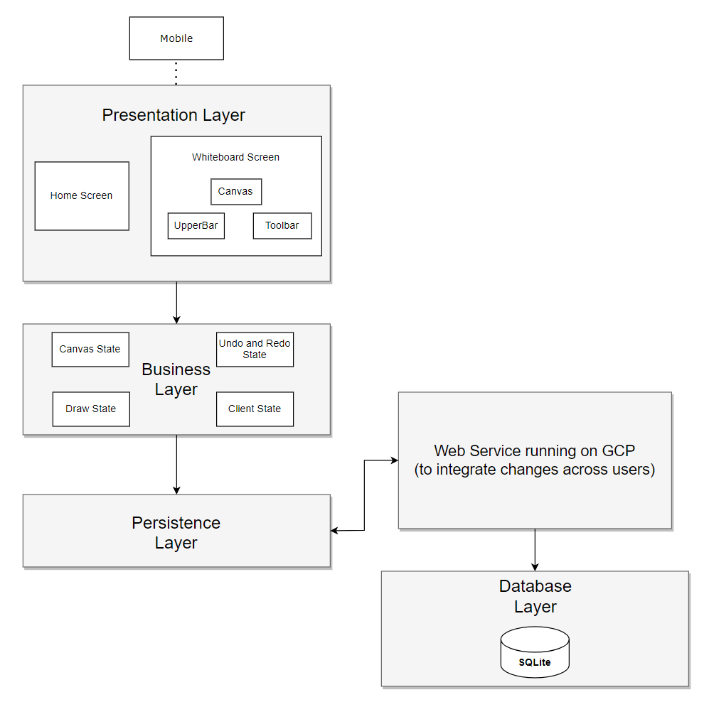

## System Architecture Diagram

## Major Design Decisions
- Tech Stack Selection: We chose to develop the app on Android with Android Studio, which influences our development and testing early on in the process.
- Feature Prioritization: We prioritized the basic functionality of Whiteboard and real-time synchronization over other minor features, which ensures the product is delivered in a timely fashion across sprints.
- UI/UX Design: We focused on developing a responsive and intuitive UI design was essential for user engagement, especially considering the app’s collaborative nature. Decisions like implementing customizable backgrounds and ensuring mobile responsiveness were crucial in enhancing user experience.
- Design for syncing undo/redo: chose to send reversed action instead of sending "undo action" referencing action to undo 
- Use a polling loop to periodically receive changes from the server (instead of using a websocket to get messages from server) 

## Challenges
- The team faced challenges in learning and adapting to the tech stack, which impacted our initial development speed.
- Developing a system for real-time collaboration, including server-client communication and a persistence layer for canvas storage, was a major undertaking. This involved complex decisions regarding data synchronization and latency management.
- Addressing UI issues such as toolbar placement, slider accessibility, and screen rotation impacts on canvas content posed design challenges. Balancing aesthetic appeal with code clarity was a continuous process throughout development.
- A custom transform gesture was needed because the transform gesture (required for zooming) didn’t work with drag gestures used for drawing

## Design Patterns and Strategies
- Agile Development: Our team worked in sprints, allowing for flexible planning, progressive development, and regular evaluation of the product.
- Singleton Pattern: We used the singleton design pattern to represent the database entities. 