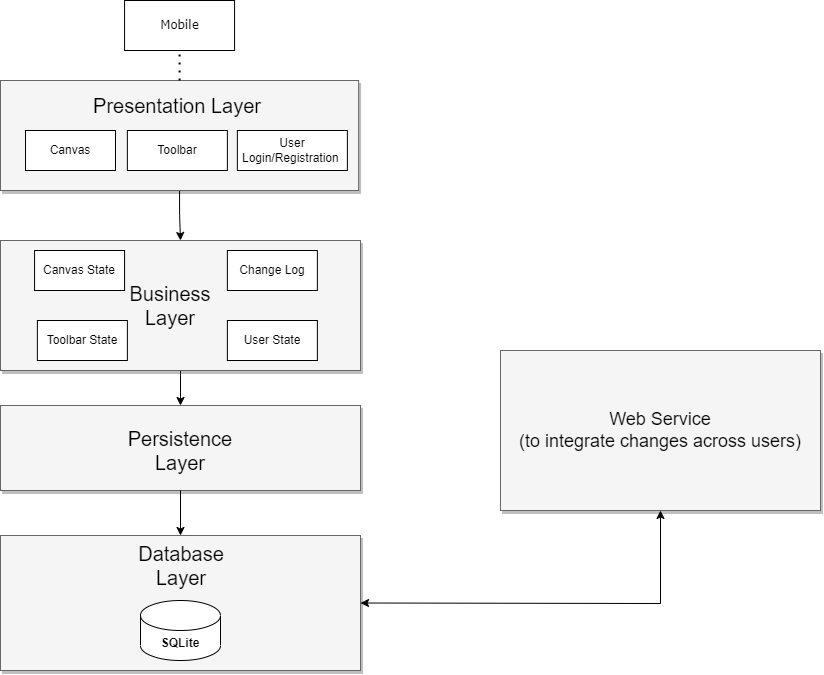

# Project Plan:

- Goals:
    - Users have difficulty collaborating remotely in a way that is intuitive, responsive, and interactive. The goal is to create an app that allows users to draw collaboratively on a virtual canvas.
- Resources:
    - 4 person development team, with restricted time due to other obligations (e.g. other courses)
- Risks:
    - Responsiveness of the whiteboard app is critical; Research on how to synchronize changes between multiple users efficiently
    - Learning the tech stack will be a challenge; Use online resources to learn
    - One’s action should not interfere with others during collaboration so users’ actions (such as undo/redo) should be tracked separately 
- Milestones:
    - Sprint 1: Basic Canvas and Sketching (Oct 4-20)
        - Basic UI and business layer setup 
        - Implement a basic canvas for sketching.
        - Support different strokes (thickness) and colors.
        - Add eraser functionality.
        - Allow resizing of the eraser.
    - Sprint 2: Core features (Oct 25-Nov 3)
        - Implement undo and redo functionality.
        - Begin real-time collaboration to synchronize canvas across multiple users.
    - Sprint 3: Continue core features (Nov 8-17)
        - Continue implementing real-time collaboration
        - Import a photo or PDF file for editing on the canvas.
        - Save whiteboard to a file.
        - Implement export to PDF and other formats.
        - Address low-priority features as time allows (e.g., preformed shapes, text annotation).
    - Sprint 4: Additional features, Finalization and Testing (Nov 22-24)
        - Implement any remaining low-priority features (e.g., preformed shapes, text annotation).
        - Ensure dark mode and customizable background.
        - Conduct unit testing and ensure mobile responsiveness.
        - Implement version history and access control.
        - Conduct final testing, bug fixes, and prepare for product delivery.

# [Requirements](https://git.uwaterloo.ca/s26nadee/cs346-project/-/wikis/Requirements)

# Design (see the [Architecture and Design](https://git.uwaterloo.ca/s26nadee/cs346-project/-/wikis/Architecture-and-Design) wiki for the updated design)

- System Diagram:

- Non-Functional Requirements: 
    - Responsiveness: target latency should be <100ms so users don’t feel lag
    - Support for 3 concurrent users per canvas initially (target for 10 later)
    - Ensure usability on various screen and canvas sizes
